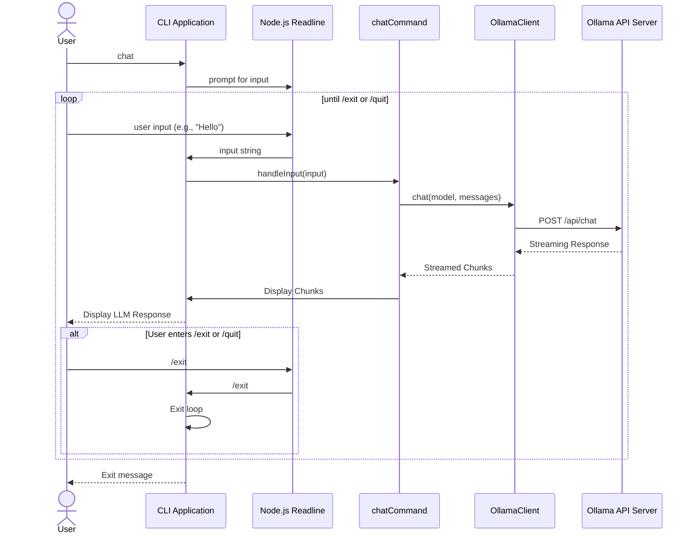

# 基本的なCLIインターフェース 設計ドキュメント

## 1. 目的

本ドキュメントは、Ollama API連携機能を利用した基本的なコマンドラインインターフェース（CLI）の設計を記述する。ユーザーからの入力受付、LLM応答の表示、モデル選択機能などを実現する。

## 2. スコープ

- コマンドライン引数のパース
- ユーザー入力の受付（対話モード含む）
- LLM応答の整形と表示
- モデル選択コマンドのCLI実装

## 3. 技術スタック

- 言語: TypeScript
- ランタイム: Node.js
- CLIフレームワーク: `commander.js` または `yargs` を検討

## 4. コマンドライン引数パースの設計

CLIフレームワークとして `commander.js` を採用する。シンプルで学習コストが低く、必要な機能が揃っているため。

### コマンド構造

- `multi-llm-agent-cli chat <prompt> [options]`
  - `<prompt>`: ユーザーの入力プロンプト。スペースを含む場合は引用符で囲む。
  - `[options]`:
    - `--model <model_name>`: 使用するOllamaモデルを指定。省略時はデフォルトモデルを使用。
- `multi-llm-agent-cli model list`
  - 利用可能なOllamaモデルを一覧表示。
- `multi-llm-agent-cli --help` / `-h`
  - ヘルプメッセージを表示。

### `src/index.ts` の役割

- `commander.js` を初期化し、コマンドとオプションを定義する。
- 各コマンドのハンドラ関数を呼び出す。
- 不明なコマンドや引数に対するエラーハンドリングとヘルプ表示。

## 5. ユーザー入力受付の設計

### 対話モード

- `multi-llm-agent-cli chat` コマンドでプロンプトが指定されない場合、対話モードに移行する。
- Node.jsの `readline` モジュールを使用して、ユーザーからの入力を継続的に受け付ける。
- ユーザーが `/exit` または `/quit` と入力した場合、対話モードを終了する。

### シーケンス図 (対話モード)

## 6. LLM応答の整形と表示の設計

- `OllamaClient` からのストリーミング応答（`ChatResponseChunk`）を `process.stdout.write` を使用してリアルタイムでコンソールに出力する。
- 初期実装では、特別な整形は行わず、受信したテキストをそのまま表示する。
- 将来的な拡張として、マークダウンのレンダリングライブラリ（例: `marked`）やシンタックスハイライトライブラリ（例: `highlight.js`）の導入を検討する。

## 7. モジュール構成

- `src/index.ts`: CLIのエントリポイント。`commander.js` の設定、コマンドのルーティング。
- `src/cli/commands/chat.ts`: `chat` コマンドのロジック。`OllamaClient` を利用し、ユーザー入力の処理とLLM応答の表示を担当。対話モードのロジックもここに実装。
- `src/cli/commands/model.ts`: `model list` コマンドのロジック。`OllamaClient` を利用し、モデル一覧の取得と表示を担当。
- `src/ollama/OllamaClient.ts`: Ollama APIとの通信を抽象化するクラス（既存）。

## 8. エラーハンドリング

- コマンドライン引数のパースエラー: `commander.js` のエラーハンドリング機能を利用し、適切なエラーメッセージとヘルプを表示する。
- Ollama API関連のエラー: `OllamaClient` からスローされるエラーを捕捉し、ユーザーに分かりやすいメッセージで表示する。
- ユーザー入力エラー: 対話モードでの不正な入力などに対するエラーメッセージ表示。

## 9. 考慮事項

- `commander.js` のインストールと設定。
- `readline` モジュールの利用方法。
- ストリーミング応答の効率的な表示方法。
