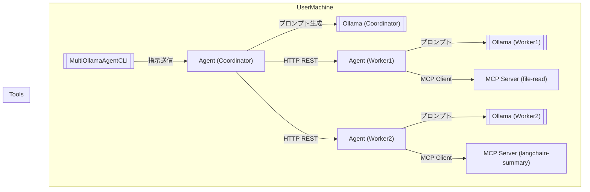

# MultiOllamaAgentCLI 機能仕様書 v0.6

## 1. 目的

MultiOllamaAgentCLI は、ローカル環境に設置された複数の Ollama エンドポイントを協調動作させ、LLM を活用した複雑なタスクを分散処理できる CLI エージェントです。社外秘情報をクラウドに送らずローカル完結する構成を前提とし、以下の特長を持ちます：

* LLM に明確な役割（指示者 / 作業者）を割り当て
* LAN 内の複数 PC 上のエージェントによる協調処理
* MCP を通じた外部ツール連携
* CLI による制御とセキュアなオペレーション

## 2. ユースケース

* プロンプトを入力してローカル LLM に応答させる
* モデル選択、履歴管理、応答内容の編集
* 外部ツール連携による要約・リライト・翻訳
* 各 LLM エージェントの協調による大規模タスク分散
* コーディングチーム構成例：

  * Coordinator: 全体管理・指示
  * Architect: 設計補助
  * Developer: 実装
  * Reviewer: 検証
  * Documenter: 文書化

## 3. 機能要件

### 3.1 CLI機能

* MCP サーバーの登録状況および許可状態（auto/ask/deny）の確認と変更

  * コマンド例：`multiollama mcp list`、`multiollama mcp enable`、`multiollama mcp disable`
* 対話中の !付きコマンドによるターミナルコマンドのパススルー
* 対話中コマンド実行の許可レベル制御（外部コマンド）
* `--config`, `--system-prompt` 起動引数によるファイル指定
* 起動ディレクトリの上位アクセス禁止機能（例外パスは `--allow-path` で明示）
* CLI セッション開始・保存・復元機能（`multiollama session start/save/load`）

### 3.2 MCPサーバー・プロトコル

* CLI または Agent から MCP クライアントを通じて MCP サーバーと通信
* MCP サーバーは stdin/stdout または SSH 経由で通信する軽量 RPC プロセス
* ツールごとに分離された MCP サーバー（例：`mcp-langchain-summary`, `mcp-file-read`）
* MCP サーバーの登録状況と許可制御は CLI から管理可能
* 注：CLI から直接 MCP サーバーを呼び出すのは管理用ユーティリティ機能のみとし、ツール実行時は必ず Agent 経由で行うこと

### 3.3 Agent 構成

* 各 PC に FastAPI ベースの Agent を起動し、Ollama ローカル API へアクセス
* Agent 間は HTTP REST で通信し、役割に応じたプロンプト処理を行う
* agent-config.yaml により、以下を定義：

  * Agent の役割（Coordinator / Developer / Reviewer 等）
  * 使用モデル（例：`llama3`, `mistral`, `code-llama`）
  * 指示対象の Agent 一覧
  * MCP サーバー呼び出しポリシー（許可・禁止・確認）

## 4. 非機能要件

* 応答タイムアウト設定（エージェント側 / MCP 側）
* MCP サーバーのヘルスチェック
* 処理履歴のログ保存（対話 / 実行コマンド / ファイルアクセス等）
* 全処理はローカル完結を前提とする
* 起動ディレクトリ配下以外のファイルアクセスは禁止。許可する場合は `--allow-path` 明示が必要
* 危険なシェルコマンドのブラックリスト実装
* コマンド・MCPツールごとの許可レベル制御（auto/ask/deny）

## 5. アーキテクチャ構成

## 6. 補足：設計原則

* LangChain などのツールは MCP サーバーでラップされる（Agent 内部に直接組み込まない）
* MCP サーバーはツールごとに 1 プロセスずつ設計され、再利用性とセキュリティを確保
* MCP 自体の実装は行わず、公式 SDK / ライブラリを活用
* MCP は統合ゲートウェイではなく、あくまで共通プロトコルであり、軽量で独立したツールアクセスレイヤーとして扱う
* MCP サーバーは HTTP ポートではなく標準入出力または SSH による接続を行う
