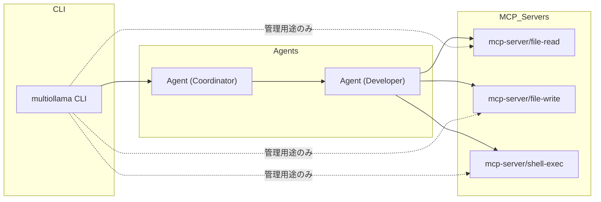

# アーキテクチャ構成（MCP関係図付き）

## 概要

本ドキュメントでは、MultiOllamaAgentCLI のアーキテクチャ構成と、MCPサーバーとの通信経路、Agent間連携の全体像を示す。

- CLIと各Agent（Coordinator, Developer など）の関係
- AgentとMCPサーバー群（file-read, file-write, shell-exec など）との接続
- MCPプロトコルに従った通信責務
- 管理用途におけるCLIからのMCP直接呼び出し（例外扱い）

---

## Mermaid構成図（通信経路）

---

## 注釈：通信原則と例外

### 通信原則

- CLI は通常、**直接 MCP サーバーに接続しない**
- タスク処理の流れは、CLI → Coordinator → Developer → MCPサーバー という **多段構成**で統一する
- これにより、セキュリティポリシーの集中管理・ロール分離が可能となる

### 例外：管理用途の直接呼び出し

- CLIからMCPサーバーを直接呼び出すケースは **管理系コマンド（例: `multiollama mcp list`）に限る**
- この通信は Agent を経由せず、**設定確認や登録用途のみに使用する**
- CLI側における直接MCPアクセスには **制限を設け、誤用を防止する**実装とする

---

## 今後の拡張

- Agent → Agent 間のP2P経路を将来的に双方向化予定
- LAN内自動検出機能により、Agent接続構成を動的に切り替えられるようにする（現時点ではMVP範囲外）

---
