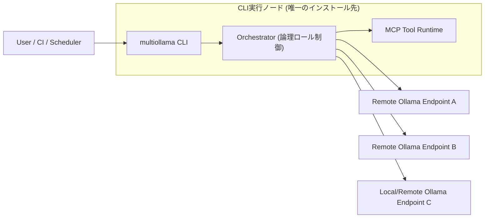

# MultiOllamaAgentCLI 理想仕様書 v1.0

本仕様書は、`feature_list.md` を正として再構成した「理想形」のプロダクト仕様である。  
既存の設計制約や実装都合は前提にせず、プロダクト価値と運用性を優先して定義する。

## 1. 目的

- ローカル完結で安全に、複数LLMを実運用できるCLIプラットフォームを提供する。
- 対話利用だけでなく、CI・定期実行・監査対応まで一貫して扱えることを目標とする。
- 配布/運用コストを最小化するため、CLI実行ノードのみへのインストールで完結させる。

## 2. 設計原則

1. Local-First: 既定でローカル完結。外部通信は明示許可制。
2. Single-Control-Node: 実行制御は `CLI実行ノード` に集約し、他ノードは `Ollama API` 提供のみとする。
3. Safety-by-Default: 既定権限は最小権限（read-only）。
4. Observable-by-Default: すべての実行は追跡可能なイベント・監査ログを残す。
5. Automation-Ready: ヘッドレス実行と機械可読出力を標準機能とする。

## 3. スコープ

### 3.1 In-Scope

- `feature_list.md` の `Must` と `Should` を v1.0 の実装対象とする。
- `Could` は v1.x 拡張として仕様予約する。

### 3.2 Non-Goals

- 独自MCPプロトコルの策定（公式SDK利用を前提）。
- クラウド前提の集中管理基盤（将来拡張扱い）。
- リモートノードへのAgentプログラム配布・常駐管理。

## 4. システム構成

補足:

- 論理ロール（coordinator/developer/reviewer等）は `CLI実行ノード内部` の実行文脈として扱う。
- リモートマシンは `Ollama` のみ待機し、AgentやMCPのインストール対象にしない。

## 5. 機能仕様

## 5.1 コア対話・実行

- `F-001` CLIチャット実行
  - 単発実行: `multiollama chat "<prompt>"`
  - 対話実行: `multiollama chat`（`/exit` で終了）
- `F-002` ストリーミング表示
  - 200ms 以内に最初の表示開始を目標（ローカル健全時）。
- `F-003` モデル選択
  - CLI引数 > セッション設定 > グローバル設定の優先順。
- `F-004` セッション管理
  - `session start/save/load/end` を提供。
  - セッションはメタデータ（モデル、権限モード、関連ファイル）を保持。
- `F-005` コンテキスト管理
  - 過去Nターン保持、要約圧縮、明示破棄をサポート。
- `F-006` 機械可読イベント出力
  - `--event-output <path>` で JSONL 出力。
  - 主要イベント: start, tool_call, approval, diff, result, error。
- `F-007` ヘッドレス実行
  - `--headless` で非対話実行。
  - 終了コード: `0=成功`, `1=業務失敗`, `2=設定/権限エラー`, `3=システム障害`。

## 5.2 論理ロール・オーケストレーション

- `F-101` ロール定義
  - 標準ロール: `coordinator`, `developer`, `reviewer`, `documenter`。
- `F-102` ロール間タスク委譲
  - 実装上は単一Control Node内のタスクキューで実現する。
- `F-103` 複数ロール協調実行
  - 複数ロールを並行実行し、異なるOllamaエンドポイントへ非同期ディスパッチ可能。
- `F-105` ループ検知
  - 同一タスク再試行回数・同一指示再循環回数に上限を設ける。

## 5.3 MCP・ツール連携

- `F-201` MCPクライアント接続
  - Control NodeがMCPを呼び出す。CLI直接呼び出しは管理用途のみ許可。
- `F-202` MCP管理
  - `mcp list/enable/disable/status`。
- `F-203/F-204/F-205` 内製ツール
  - `file_read`, `file_write`, `shell_exec` を標準搭載。
  - 全ツールに `timeout`, `policy_decision`, `audit_id` を付与。
- `F-206` 外部MCP接続
  - ツール登録時に権限宣言（アクセス範囲、危険操作有無）を必須化。

## 5.4 エンドポイント運用

- `F-301/F-302` エンドポイント管理
  - add/remove/list/use を提供。
- `F-303` フォールバック
  - 障害検知時に優先順位テーブルに基づき自動切替。
  - 切替イベントを監査ログへ記録。

## 5.5 セキュリティ・権限

- `F-401/F-402` 認証認可
  - コンポーネント間通信はトークン認証必須。
  - ロールベース + ツールポリシーベース認可。
- `F-403` パス制御
  - 既定は起動ディレクトリ配下のみ許可。
- `F-404` 実行許可レベル
  - `auto/ask/deny` をコマンド種別・ツール種別ごとに設定。
- `F-405` 権限モード
  - `read-only`, `workspace-write`, `full-access` をセッション単位で選択。
  - 既定は `read-only`。
- `F-406` 危険コマンド防止
  - denylist + allowlist + パターン検知の三段階で実行判定。

## 5.6 信頼性・運用

- `F-501` エラー分類
  - `user_error`, `policy_error`, `tool_error`, `network_error`, `system_error`。
- `F-502` リトライ
  - 指数バックオフ（最大3回、ジッター有）。
- `F-503` ヘルスチェック
  - Control Node, MCP, Endpoint すべてに活性監視。
- `F-504` 構造化ログ
  - JSON形式で統一（timestamp, level, session_id, task_id, component）。
- `F-505` 監査ログ
  - 承認操作、権限変更、ファイル書き込み、コマンド実行を必須記録。
- `F-506` チェックポイント/ロールバック
  - 主要操作前に復元点を作成可能。

## 5.7 開発者体験・拡張

- `F-601` 設定スキーマ
  - `config.yaml` と `agent-config.yaml` を厳密検証（起動時バリデーション失敗で停止）。
- `F-602` カスタムコマンド
  - プロジェクトローカルに再利用コマンド定義を配置可能。
- `F-603` Recipe/Prompt Pack
  - 定型手順をテンプレート化し、再実行可能にする。

## 6. 非機能要件（SLO）

1. 可用性

- 単一ノード稼働率目標: 99.5%/月（ローカル停止時間を除く）。

2. 性能

- チャット応答の初回トークン表示: P95 2.0秒以内（ローカルOllama健全時）。
- MCPツール実行開始: P95 500ms 以内（ローカルプロセス健全時）。

3. 信頼性

- タスク実行失敗時の再試行・フォールバック成功率をメトリクス化。

4. 監査性

- すべての破壊的操作に `actor`, `reason`, `approval` を紐づける。

## 7. データ契約

1. 実行イベント（JSONL）

- 必須項目: `event_id`, `timestamp`, `session_id`, `task_id`, `type`, `payload`。

2. 監査イベント

- 必須項目: `audit_id`, `actor`, `action`, `target`, `policy_result`, `approved_by`。

3. タスク状態

- `pending`, `running`, `waiting_approval`, `succeeded`, `failed`, `cancelled`。

## 8. 設定モデル

1. `config.yaml`

- グローバルモデル設定、エンドポイント一覧、既定権限モード、ログ出力先、スケジューラ設定。

2. `agent-config.yaml`

- ロール定義、利用モデル、エンドポイント選択方針、MCP許可ポリシー、許可パス、拒否コマンド、タイムアウト。

## 9. 受け入れ基準

1. Must/Shouldの満たし込み

- `feature_list.md` の `Must` と `Should` が受け入れテストで満たされること。

2. セキュリティ検証

- 権限外ファイルアクセス、危険コマンド、未承認実行が拒否されること。

3. 自動化検証

- `--headless` + JSONL出力で CI 判定が可能であること。

## 10. 段階的リリース方針

1. v1.0

- Must + Should を実装対象とする。

2. v1.1+

- Could（ブラウザツール、ラウンドロビン高度化、スケジュール実行、コスト可視化等）を順次追加。

## 11. 機能別仕様リンク

- 機能一覧: [./feature_list.md](./feature_list.md)
- 機能別詳細インデックス: [./features/README.md](./features/README.md)
- ユーザー可視振る舞い仕様: [./spec_user_visible_behavior.md](./spec_user_visible_behavior.md)
- 配置モデル仕様: [./deployment_model_single_control_node.md](./deployment_model_single_control_node.md)

---

### 補足

- 本仕様は既存設計より優先される「理想仕様」であり、既存ドキュメントとの差分は移行計画で管理する。
